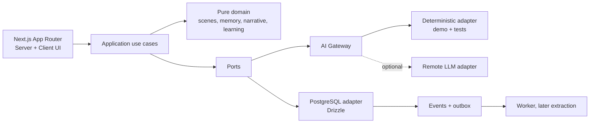
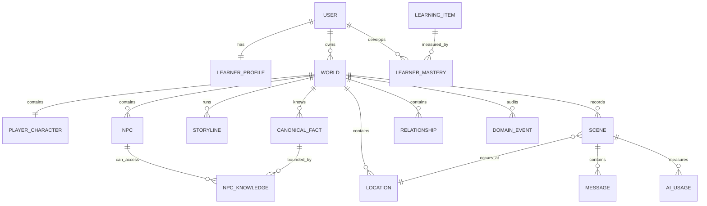

# LifeLang — Piano tecnico del vertical slice

Stato: approvazione implicita tramite avvio del progetto, 12 luglio 2026.

## 1. Sintesi della soluzione

LifeLang viene realizzato come monolite modulare TypeScript. Il primo incremento dimostra il ciclo più rischioso del prodotto:

`conversazione → fatto validato → conseguenza → scena coerente → apprendimento`

La demo iniziale segue un imprenditore italiano appena arrivato a New York. La prima scena è una conversazione con il proprietario di casa; una promessa dell'utente viene trasformata in un comando di dominio validato, registrata nell'event ledger e resa visibile nella schermata Today. Il debrief aggiorna separatamente produzione e riconoscimento di un learning item.

## 2. Scope del primo incremento

Incluso:

- shell responsive con Today, World, People, Journey ed English;
- identità demo persistente esplicitamente indicata come tale;
- mondo seed con quattro luoghi, tre NPC e una storyline;
- scena testuale deterministica con messaggi persistiti;
- adapter AI sostituibile e output validato;
- event ledger idempotente;
- memoria strutturata, ispezionabile e correggibile;
- relazione utente–NPC;
- conseguenza visibile in Today;
- debrief con massimo tre elementi;
- logging di token, latenza e costo stimato;
- test del dominio e demo riproducibile.

Stato implementazione M2: profilo, scena, turni, eventi, usage, memoria, knowledge boundary, relazione, storyline e mastery sono persistiti su Neon attraverso API validate e mutation idempotenti. Il repository locale resta soltanto fallback esplicito.

Rinviato, ma previsto nei confini architetturali:

- autenticazione production-grade e gestione account;
- provider LLM reale e streaming SSE;
- voce STT/TTS;
- embedding e pgvector;
- worker/outbox separato;
- simulazione offline;
- backoffice e authoring visuale;
- app mobile.

## 3. Architettura



Confini logici:

1. `identity`: sessione, ownership e autorizzazione;
2. `learner`: profilo CEFR, preferenze e mastery;
3. `world`: tempo, luoghi, agenda e stato canonico;
4. `characters`: NPC, conoscenze e relazioni;
5. `narrative`: storyline, precondizioni e conseguenze;
6. `scenes`: brief congelato, turni e chiusura atomica;
7. `memory`: candidati, fatti, correzione e knowledge boundary;
8. `learning`: valutazione, debrief e ripetizione;
9. `ai`: contratti validati, routing e telemetria;
10. `safety`: input policy e redazione;
11. `observability`: correlation ID, costo e latenza.

Il dominio non importa Next.js, Drizzle o SDK di provider AI. Gli use case dipendono da porte. Un output generativo propone comandi ma non scrive mai direttamente lo stato canonico.

## 4. Struttura del repository

```text
apps/
  web/                  Next.js, route handlers e UI
packages/
  domain/               entità, value object, regole e use case puri
  contracts/            schemi Zod e tipi API/AI/eventi
  db/                   schema Drizzle, migrazioni, seed e repository
  ai/                   gateway, adapter deterministico e provider futuri
  ui/                   componenti condivisi (quando il secondo client lo richiede)
docs/
  adr/                   decision record
  api/                   OpenAPI
  TECHNICAL_PLAN.md
```

## 5. Modello dati ed ER



Tabelle essenziali:

- `users`, `learner_profiles`, `worlds`, `player_characters`;
- `npcs`, `locations`, `relationships`;
- `storylines`, `scenes`, `messages`;
- `canonical_facts`, `npc_knowledge`, `episodic_memories`;
- `learning_items`, `learner_mastery`, `language_evaluations`;
- `domain_events`, `outbox_events`, `ai_usage`.

Ogni record world-scoped contiene `world_id`; le query verificano anche l'ownership dell'utente. `scenes.version` abilita optimistic locking. `domain_events.idempotency_key` è univoca nel mondo. Le memorie corrette vengono marcate `superseded` e collegate alla versione sostitutiva.

## 6. Flussi principali

### Apertura di Today

1. autorizzazione del mondo;
2. lettura parallela di agenda, messaggi, storyline e proposta scena;
3. massimo tre priorità ordinate per urgenza e rilevanza narrativa;
4. nessuna generazione AI necessaria per il primo rendering.

### Turno conversazionale

1. valida input, scena attiva e ownership;
2. registra `USER_SPOKE` con idempotency key;
3. costruisce knowledge boundary dell'NPC;
4. invoca un solo adapter AI con `SceneBrief` congelato;
5. valida `NPCTurn`;
6. scarta comandi non autorizzati;
7. registra risposta, usage e `NPC_RESPONDED` nella stessa unità di lavoro;
8. restituisce testo e stato scena.

### Fine scena

1. optimistic lock sulla scena;
2. determina l'esito con regole pure;
3. applica relazione e storyline;
4. approva solo memorie supportate da evidenza;
5. registra eventi/outbox e commit atomico;
6. genera debrief e retry asincrono se necessario;
7. aggiorna Today con la conseguenza.

### Correzione memoria

1. l'utente apre una memoria visibile;
2. invia correzione o cancellazione;
3. il dominio crea una nuova versione o stato `deleted`;
4. emette `MEMORY_CORRECTED`;
5. invalida knowledge link e indice semantico precedente;
6. le scene successive ricevono solo la versione attiva.

## 7. Contratti ed eventi

Contratti AI versionati:

- `SceneProposal@1`;
- `SceneBrief@1`;
- `NPCTurn@1`;
- `MemoryExtraction@1`;
- `LanguageEvaluation@1`.

Eventi MVP:

- `SCENE_STARTED`, `USER_SPOKE`, `NPC_RESPONDED`, `SCENE_COMPLETED`;
- `FACT_DISCOVERED`, `MEMORY_CREATED`, `MEMORY_CORRECTED`;
- `RELATIONSHIP_CHANGED`, `STORYLINE_ADVANCED`;
- `LEARNING_OBJECTIVE_UPDATED`, `MESSAGE_RECEIVED`, `LOCATION_VISITED`.

Envelope comune: `id`, `worldId`, `type`, `schemaVersion`, `actor`, `payload`, `occurredAt`, `correlationId`, `causationId?`, `idempotencyKey`.

## 8. API

La specifica completa è in `docs/api/openapi.yaml`. Superficie iniziale:

- `GET /api/today`;
- `GET /api/world`;
- `GET /api/people`;
- `POST /api/scenes/:id/start`;
- `POST /api/scenes/:id/turns`;
- `POST /api/scenes/:id/complete`;
- `GET /api/memories`;
- `PATCH /api/memories/:id`;
- `GET /api/learning/progress`.

Le mutation accettano `Idempotency-Key`; tutte restituiscono `correlationId`.

## 9. Prompt strategy

I prompt sono template piccoli, versionati e orientati a un singolo compito. Ogni invocation registra versione e hash. Il prompt NPC riceve solo:

- identità e stile del personaggio;
- brief scena congelato;
- relazione con l'utente;
- massimo 3–5 fatti canonici autorizzati;
- massimo 2–4 episodi pertinenti;
- learning objective in forma di vincolo, mai rubriche interne visibili.

Il fake adapter non emula una conversazione libera: implementa casi golden espliciti e produce gli stessi contratti del provider futuro, consentendo test ripetibili di validazione e conseguenze.

## 10. Piano test ed eval

Unit:

- precondizioni storyline e optimistic version;
- applicazione idempotente dei comandi;
- knowledge boundary e mancata esposizione di segreti;
- correzione/superseding delle memorie;
- limiti del debrief e mastery separata;
- budget AI.

Integration:

- transazione fine scena;
- isolamento user/world;
- outbox e retry;
- seed e demo flow completo.

E2E:

- apri Today, inizia la scena, prometti di rispettare una regola, completa;
- verifica memoria e conseguenza;
- correggi la memoria;
- riapri la scena successiva e verifica il contesto aggiornato.

Golden eval futuri vengono eseguiti a ogni cambio di modello, prompt, schema o retrieval policy.

## 11. Modello di costo

Ogni chiamata registra modello, scopo, prompt version, token in/out, audio seconds, latenza, retry, cache hit, costo e stato. Budget iniziale configurabile:

- 16 turni per scena;
- 8.000 token input cumulativi;
- 2.500 token output cumulativi;
- limite giornaliero per piano;
- fallback al testo e chiusura guidata quando il budget è esaurito.

Formula: `inputTokens × inputRate + outputTokens × outputRate + audioSeconds × audioRate`. Le tariffe non vengono hardcoded nel dominio ma lette da configurazione versionata.

## 12. Deployment

Primo target: una web app containerizzata e PostgreSQL gestito. Migrazioni eseguite come job separato prima del rollout. Variabili sensibili arrivano dal secret manager. Health check separati per processo e dipendenze. Log strutturati senza testo integrale delle conversazioni. Backup, retention audio e data deletion vengono verificati prima del beta.

## 13. Backlog con dipendenze

| Milestone | Obiettivo | Dipende da | Criterio di uscita |
| --- | --- | --- | --- |
| M0 Foundation | workspace, CI, DB, contratti, fake AI | — | lint, typecheck e test verdi |
| M1 World | onboarding essenziale, 4 luoghi, 3 NPC, Today | M0 | mondo seed navigabile |
| M2 Conversation | scena testuale e usage | M1 | turni persistiti e validati |
| M3 Consequence | memoria, boundary, relazione, storyline | M2 | promessa influenza Today/scena successiva |
| M4 Learning | evaluation, mastery, debrief | M2 | max 3 feedback e item riproposto |
| M5 Quality | E2E, privacy, correzione memoria, staging | M3–M4 | demo riproducibile e auditabile |
| M6 Voice | STT/TTS adapter, interruption, retention | M5 | latenza e privacy accettabili |

## 14. Assunzioni e decisioni

- Italiano è la lingua UI; inglese è la lingua della vita virtuale.
- Livello seed B1, assisted mode, realismo realistico.
- New York e tempo ibrido; gli eventi importanti restano disponibili.
- La prima scena usa Arthur Bennett, proprietario dell'appartamento; Maya Chen è la barista; Marcus Reed è il potenziale cliente.
- L'autenticazione reale richiede una scelta provider e viene sostituita nel walking skeleton da un'identità demo chiaramente marcata.
- PostgreSQL è l'unico source of truth production; pgvector, Redis e object storage entrano soltanto quando una capability li richiede.
- Il provider AI reale è una configurazione, non una dipendenza del dominio.

## 15. Rischi e mitigazioni

- **Scope:** consegne verticali e criteri d'uscita, niente città “larga ma vuota”.
- **Coerenza:** stato canonico, brief congelato, comandi autorizzati ed event ledger.
- **Leakage:** query per world/owner e test del knowledge boundary.
- **Costo/latency:** rendering Today senza AI, retrieval limitato, budget e streaming futuro.
- **Qualità didattica:** debrief selettivo, evidenza sul messaggio, recognition/production separate.
- **Lock-in:** porte per DB, AI e speech; contratti interni versionati.
- **Privacy:** separazione delle identità, log redatti, memoria ispezionabile/cancellabile.

## 16. Decisioni che richiederanno approvazione

Non bloccano M0–M3:

- provider di autenticazione;
- provider LLM/STT/TTS e budget economico reale;
- infrastruttura cloud e regione dati;
- policy mature content;
- modalità di monetizzazione e relativi limiti.
